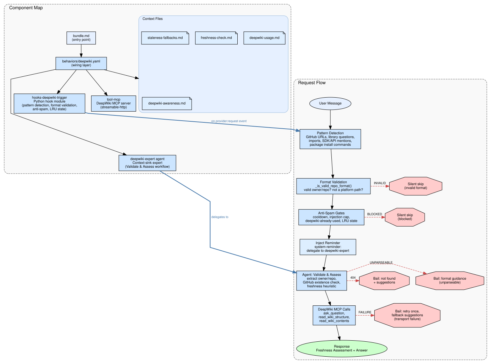

# amplifier-bundle-deepwiki

AI-powered open-source project understanding via [DeepWiki](https://deepwiki.com/).

This Amplifier bundle helps developers understand how open-source libraries, frameworks, 
and tools work internally, making it easier to use, extend, and integrate with them.

---

## External Service Dependency

> **This bundle uses the [DeepWiki MCP Server](https://mcp.deepwiki.com/mcp)**
> 
> DeepWiki is an AI-powered documentation platform by [Cognition](https://cognition.ai/) 
> (creators of [Devin](https://devin.ai/)). It provides intelligent analysis of public 
> GitHub repositories.
> 
> - **MCP Endpoint:** `https://mcp.deepwiki.com/mcp`
> - **Web Interface:** [deepwiki.com](https://deepwiki.com/)
> - **Protocol:** [Model Context Protocol (MCP)](https://modelcontextprotocol.io/)
> 
> By using this bundle, you are consuming DeepWiki's public MCP API. Please respect 
> their service and rate limits.

---

## Features

- **AI-Powered Documentation Analysis** - Ask questions about any public GitHub repository
- **Architecture Understanding** - Explore how projects are structured and designed
- **Extension Guidance** - Find the right way to extend or customize libraries
- **Integration Patterns** - Learn how to integrate with open-source tools
- **Progressive Discovery** - Efficient question-first exploration strategy
- **Proactive Freshness Verification** - Every response includes a Freshness Assessment comparing DeepWiki's index against live GitHub data

## Installation

DeepWiki is a **capability bundle** — most users want to *add* it on top of their
existing setup rather than replace their active bundle. Pick the pattern that fits.

### Add DeepWiki to Your Existing Setup (Recommended)

Layer DeepWiki onto every session with the `--app` flag. Your current bundle
(`foundation`, `dev`, `recipes`, etc.) stays active and DeepWiki capabilities are
composed on top automatically:

```bash
amplifier bundle add git+https://github.com/colombod/amplifier-bundle-deepwiki@main --app
```

That's it — DeepWiki is now available in every session. No `bundle use` needed.

### Use as Your Primary Bundle

To make DeepWiki your active bundle instead (it includes foundation capabilities):

```bash
# Add the bundle to your registry
amplifier bundle add git+https://github.com/colombod/amplifier-bundle-deepwiki@main

# Set as active
amplifier bundle use deepwiki
```

Control the scope of `bundle use` with `--local`, `--project`, or `--global`:

```bash
amplifier bundle use deepwiki --local    # Just you, in this project
amplifier bundle use deepwiki --project  # Whole team (commit .amplifier/settings.yaml)
amplifier bundle use deepwiki --global   # All your projects
```

## Usage

### Interactive Session

```bash
amplifier
```

Then ask questions about open-source projects:

```
> How does React's reconciliation algorithm work?
> What's the architecture of the FastAPI framework?
> How can I add a custom provider to LangChain?
> What are the command and event patterns in dotnet/interactive?
```

### Single Query

```bash
amplifier run "Explain how Express.js middleware works"
```

### Compose into Your Own Bundle (Bundle Authors)

If you're *building* a bundle and want DeepWiki's behavior baked in as a reusable
capability, add it to your `bundle.md` (or a behavior YAML) `includes:` list:

```yaml
includes:
  - bundle: git+https://github.com/colombod/amplifier-bundle-deepwiki@main#subdirectory=behaviors/deepwiki.yaml
```

This pulls in only the DeepWiki behavior (MCP config + trigger hook + expert agent),
not the full standalone bundle. Use this when authoring a bundle; use `--app` (above)
when you just want DeepWiki layered onto your own sessions.

## How It Works

This bundle integrates with the **DeepWiki MCP Server** using the 
[Model Context Protocol](https://modelcontextprotocol.io/).

### Architecture



### MCP Tools Provided

| Tool | Description |
|------|-------------|
| `mcp_deepwiki_read_wiki_structure` | Get documentation structure for a repository |
| `mcp_deepwiki_read_wiki_contents` | Read full wiki content (can be 400k+ chars) |
| `mcp_deepwiki_ask_question` | AI-powered Q&A about any public repository |

### Progressive Discovery Strategy

The bundle implements a **questions-first approach** for efficient exploration:

```
1. Start with simple questions (fastest)
2. Build understanding progressively  
3. Deep dive into content only when needed
```

This avoids the overhead of reading massive wiki content (400k+ chars) when 
targeted questions can get you answers faster.

## Bundle Structure

```
amplifier-bundle-deepwiki/
├── bundle.md                           # Thin root bundle
├── behaviors/
│   └── deepwiki.yaml                   # Reusable behavior (MCP config + agent)
├── agents/
│   └── deepwiki-expert.md              # Context-sink expert agent
├── context/
│   ├── deepwiki-awareness.md           # Thin awareness for delegation
│   ├── deepwiki-usage.md               # Detailed usage patterns
│   ├── freshness-check.md              # Pre-flight freshness protocol
│   └── staleness-fallbacks.md          # Staleness fallback strategies
└── docs/
    └── USAGE.md                        # Human documentation
```

## Requirements

- [Amplifier](https://github.com/microsoft/amplifier) CLI installed
- Internet connection (for DeepWiki MCP server)
- A configured LLM provider (Anthropic, OpenAI, etc.)

## Limitations

- **Public repositories only** — DeepWiki indexes public GitHub repositories. Private or non-existent repos are detected early: the agent checks GitHub for a 200 response before making any DeepWiki calls, and bails out with helpful suggestions if the repo isn't found.
- **DeepWiki indexing required** — Very new or obscure repos may not yet be indexed. The agent handles this gracefully.
- **Complex queries** — May timeout; the agent breaks them into smaller questions automatically.

## Contributing

Contributions are welcome! Please feel free to submit issues and pull requests.

## License

MIT License - see [LICENSE](LICENSE) for details.

---

## Acknowledgments

This bundle would not be possible without:

- **[DeepWiki](https://deepwiki.com/)** - AI-powered documentation platform that 
  provides the knowledge base for understanding open-source projects
  
- **[Cognition](https://cognition.ai/)** - The team behind DeepWiki and Devin, 
  who provide the public MCP server at `https://mcp.deepwiki.com/mcp`
  
- **[Model Context Protocol](https://modelcontextprotocol.io/)** - The open protocol 
  that enables this integration
  
- **[Amplifier](https://github.com/microsoft/amplifier)** - The modular AI agent 
  framework that makes this bundle possible
